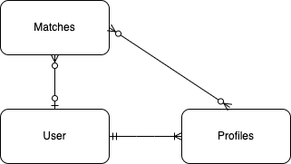

# Connect 4 API

A clone of the classic game Connect 4. Using React to Create the application and ... (Come back to me...)

Used in conjunction with my [connect 4 client](https://github.com/Valkarie01/Connect-4-Client)

# Tech Used - MERN Stack

Mongoose
Express
React
Node

# ERD 

# Models

### Profile Model
- 1 to Many realationship with Users
- Many to Many relationship with Matches
- Profiles allow a user to keep track of players in matches this is especially helpful for "hot seat" style playing where two players are playing on the same machine. (OUR MVP)

#### Fields 
- name: String
- matches: refId
- owner: refId

### Matches 
- Many to 1 relationship with users
- Many to Many relationship with Profiles
- Matches allows a user to track the rounds you win or lose between profiles.

#### Fields 
- player1: refId - Profiles
- player2: refId - Profiles
- rounds: Number - Best of 1 or Best of 3 (ennum?)
- roundHistory: [String] - Where each index is the winner of that round
- isDone: Boolean 
- winner: String

# Route Table 

| Description | Verb | Url |
| ----- | ------ | ------ | 
| Sign up | POST | /signup |
| Sign in | POST | /signin |
| Sign out | DELETE | /signout |
| Change password | PATCH | /change-password |
| Index Profiles | GET | /profiles |
| Single Profile | GET | /profiles/:id |
| Create Profile | POST | /profiles |
| Update Profile | PATCH | /profiles/:id |
| Delete Profile | DELETE | /profiles/:id |
| Index Matches | GET | /matches |
| Single Match | GET | /matches/:id |
| Create Match | POST | /matches |
| Update Match | PATCH | /matches/:id |
| Delete Match | DELETE | /matches/:id |